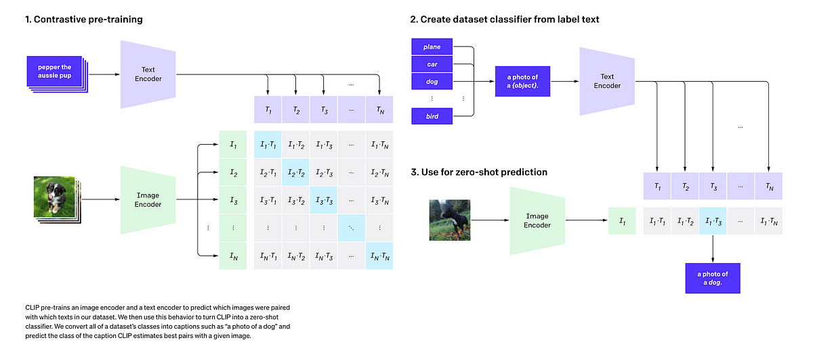
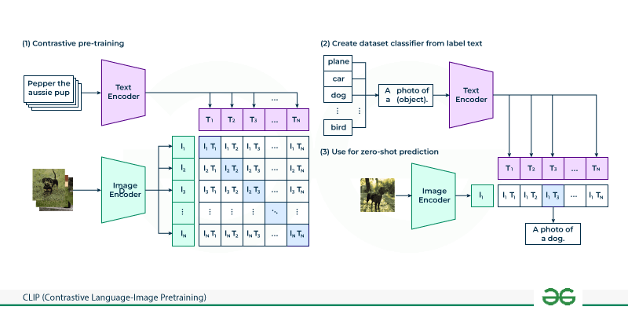
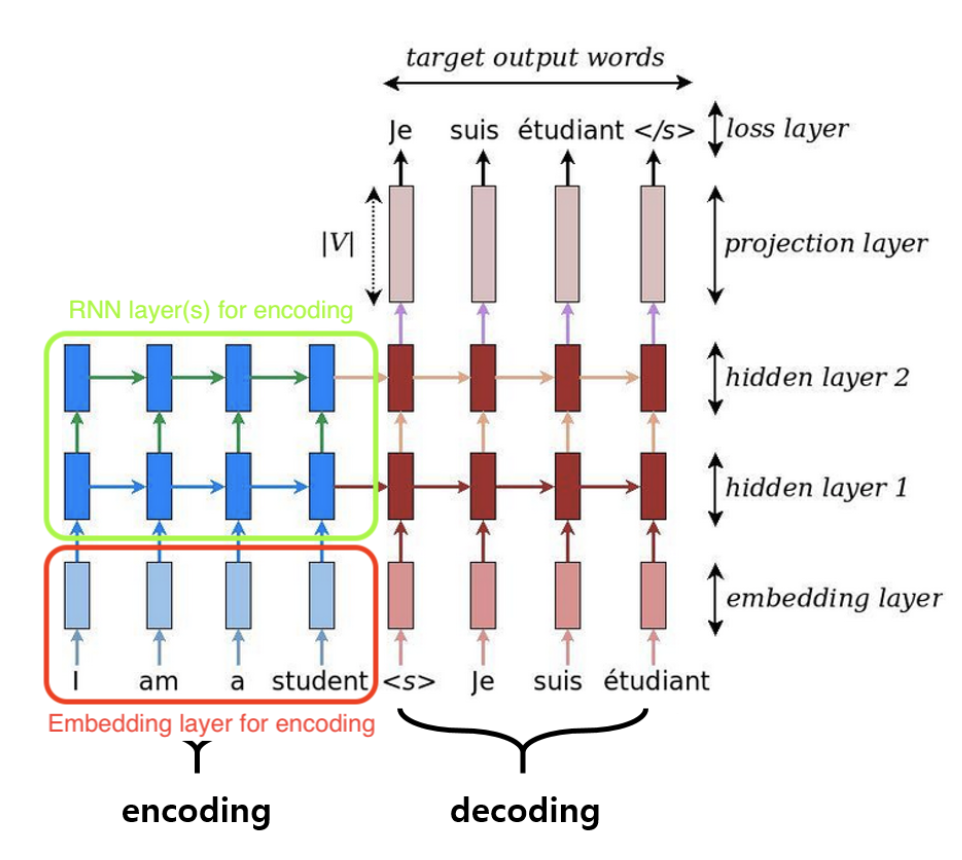
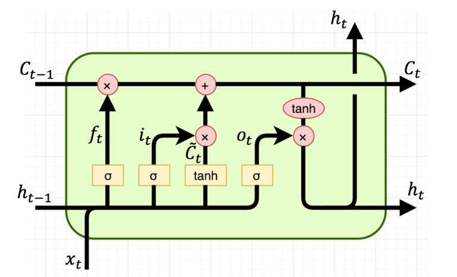
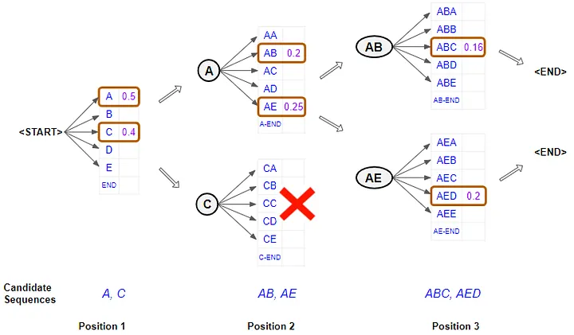
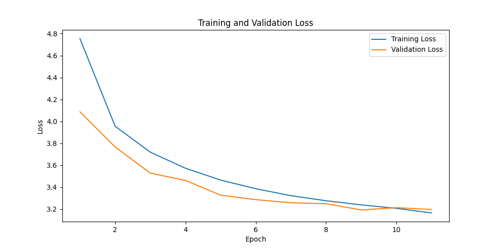
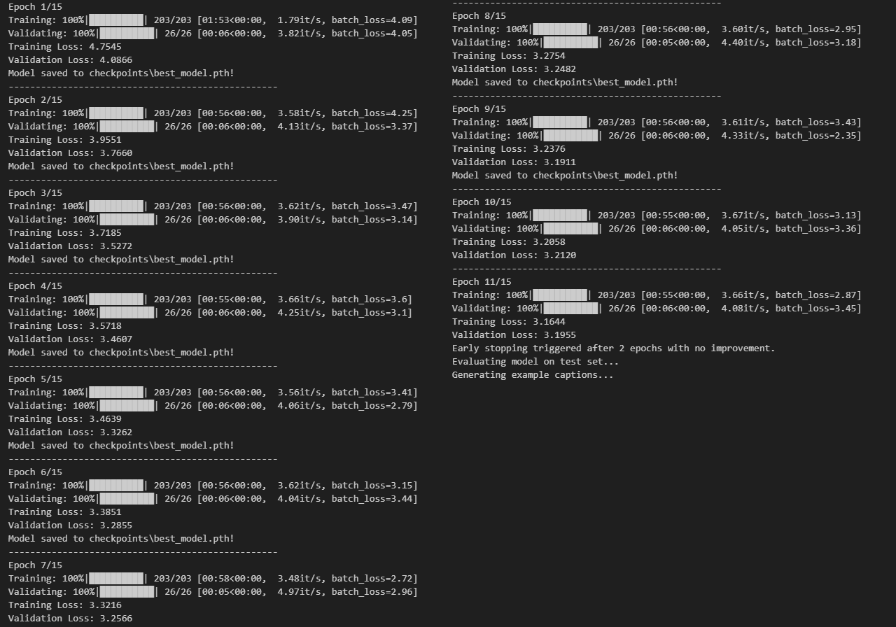

# Ứng dụng Mô hình CLIP và LSTM trong Bài toán Tạo Chú thích Ảnh (Image Captioning)

<p align="center">
  
  
  
  
  
  
</p>

Đây là báo cáo bài tập lớn môn **Xử lý ngôn ngữ tự nhiên (NLP)** của nhóm sinh viên chúng em tại **Trường Đại học Xây dựng Hà Nội (HUCE)**. Đề tài tập trung vào việc nghiên cứu và thử nghiệm kết hợp mô hình học sâu đa phương thức (CLIP) để trích xuất đặc trưng hình ảnh và mạng LSTM có tích hợp cơ chế Attention để sinh câu chú thích tương ứng.

<p align="center">
  
</p>

---

## 👥 Thông tin Nhóm thực hiện & Giảng viên hướng dẫn

* **Giảng viên hướng dẫn:** ThS. Nguyễn Đình Quý (Bộ môn Khoa học máy tính, Khoa Công nghệ thông tin)
* **Sinh viên thực hiện (Nhóm lớp 67CS1):**
  1. Nguyễn Hải Cường - MSSV: 0174067
  2. Lã Minh Khánh - MSSV: 4004267
  3. Trịnh Quỳnh Anh - MSSV: 0279367
  4. Phạm Hồng Thái - MSSV: 0127067

---

## 📝 Tóm tắt đề tài (Abstract)
Đề tài của nhóm em giải quyết bài toán **Tạo chú thích hình ảnh tự động (Image Captioning)** - một bài toán giao thoa giữa Thị giác máy tính (Computer Vision) và Xử lý ngôn ngữ tự nhiên (NLP). Nhóm em sử dụng phương pháp Học chuyển giao (Transfer Learning), sử dụng mô hình pre-trained **CLIP (ViT-B/32)** làm Encoder để trích xuất đặc trưng ngữ nghĩa chất lượng cao của ảnh, sau đó đưa qua mạng **LSTM kết hợp cơ chế Attention** làm Decoder để sinh ra mô tả ngôn ngữ tự nhiên phù hợp. Dự án được huấn luyện và đánh giá trên bộ dữ liệu chuẩn **Flickr8k**.

---

## 📸 Demo kết quả thực tế
Dưới đây là một số ví dụ kết quả mô tả ảnh do mô hình của nhóm em sinh ra (Prediction - P) so sánh với mô tả gốc do con người viết (Ground Truth - GT):

<p align="center">
  
</p>

> [!WARNING]
> **Nhận xét khách quan:** Mô hình của nhóm em hiện tại vẫn gặp nhiều hạn chế khi chạy thực tế. Trong một số trường hợp, mô hình bị xu hướng hội tụ về các câu mô tả quá phổ biến trong tập train (ví dụ: hình người đàn ông cầm cờ bị dịch nhầm thành *"a dog is running through a field"*, hay ảnh hai người phụ nữ đứng trước cửa hàng bị gán nhãn *"a black dog is running through the grass with a ball in its mouth"*). Nhóm em đã phân tích chi tiết nguyên nhân này ở phần đánh giá bên dưới.

---

## 📐 Phương pháp & Kiến trúc Hệ thống

### 1. Luồng xử lý tổng quan (System Flowchart)
Quy trình từ lúc nhập ảnh đầu vào cho tới khi sinh ra câu chú thích hoàn chỉnh được thực hiện qua các bước dưới đây:

<p align="center">
  
</p>

1. **Tiền xử lý:** Ảnh được đưa về kích thước chuẩn và chuẩn hóa theo bộ tiền xử lý của CLIP. Văn bản được tách từ (tokenize) bằng thư viện NLTK, chuyển về chữ thường, lọc các từ ít xuất hiện (tần suất < 5) và thêm các token đặc biệt (`<SOS>`, `<EOS>`, `<PAD>`, `<UNK>`).
2. **Trích xuất đặc trưng (Encoder):** Ảnh sau tiền xử lý được đưa qua mô hình CLIP để trích xuất vector đặc trưng ngữ nghĩa trong không gian nhúng đồng nhất (multi-modal embedding space).
3. **Sinh câu chú thích (Decoder):** Vector đặc trưng ảnh kết hợp với trạng thái ẩn được đưa vào mạng LSTM có tích hợp cơ chế Attention để sinh ra từng từ kế tiếp.
4. **Tìm kiếm chuỗi tối ưu:** Nhóm em áp dụng thuật toán **Beam Search** để chọn ra câu mô tả có xác suất cao nhất thay vì chọn tham lam (Greedy Search).

---

### 2. Các kiến trúc thành phần

#### Mô hình CLIP (Encoder)
CLIP (Contrastive Language-Image Pre-training) của OpenAI giúp ánh xạ cả ảnh và văn bản vào chung một không gian vector. Nhóm em sử dụng phiên bản backbone **ViT-B/32** để trích xuất các đặc trưng ngữ nghĩa toàn cục của bức ảnh.

<p align="center">
  
</p>

#### Mạng LSTM kết hợp Attention (Decoder)
Thay vì chỉ truyền thông tin ảnh vào trạng thái khởi tạo của LSTM, cơ chế Attention cho phép mạng giải mã tập trung vào các vùng đặc trưng quan trọng của ảnh tương ứng với từng từ được sinh ra tại mỗi bước thời gian.

| Sơ đồ cơ chế Attention | Kiến trúc LSTM |
| :---: | :---: |
|  |  |

#### Thuật toán Beam Search
Để tăng chất lượng câu sinh ra, thuật toán Beam Search lưu lại top $k$ (trong bài này nhóm chọn $beam\_size = 5$) tiền tố câu có xác suất tích lũy lớn nhất tại mỗi bước sinh từ, giúp tránh các lựa chọn tối ưu cục bộ.

<p align="center">
  
</p>

---

## 📊 Kết quả Thực nghiệm

### 1. Quá trình huấn luyện (Training Curve)
Nhóm em cấu hình huấn luyện với các siêu tham số chính như sau:
* Kích thước từ nhúng (`embed_size`): 256
* Số chiều ẩn (`hidden_size`): 512
* Kích thước batch (`batch_size`): 32
* Tốc độ học (`learning_rate`): 3e-4 (sử dụng thuật toán tối ưu Adam)
* Số epoch tối đa: 15 epoch (có sử dụng `early_stopping` với patience = 2)

Quá trình training thực tế dừng sớm ở epoch thứ 11 do validation loss không giảm thêm trong 2 epoch liên tiếp. Mô hình tốt nhất được lưu lại ở epoch thứ 9 với validation loss đạt **3.1911**.

| Đồ thị Loss Curve | Nhật ký console huấn luyện |
| :---: | :---: |
|  |  |

---

### 2. Đánh giá định lượng trên tập Test
Nhóm em sử dụng thang đo **BLEU (Bilingual Evaluation Understudy)** từ 1-gram đến 4-gram để đánh giá độ tương đồng giữa câu chú thích sinh ra bởi mô hình và câu chú thích gốc do con người viết:

| Chỉ số | Giá trị |
| :---: | :---: |
| **BLEU-1** | 0.2706 |
| **BLEU-2** | 0.0850 |
| **BLEU-3** | 0.0382 |
| **BLEU-4** | 0.0201 |

---

### 3. Nhận xét & Hạn chế của bài tập lớn
Từ kết quả thực nghiệm trên, nhóm em tự rút ra một số nhận xét như sau:
1. **Lỗi lặp từ và câu mô tả chung chung:** Do bộ dữ liệu Flickr8k có quy mô nhỏ (8,000 ảnh) và chứa nhiều caption mô tả chó chạy trên cỏ, mô hình của nhóm em bị thiên lệch dữ liệu nghiêm trọng. Khi gặp các bức ảnh lạ, mô hình có xu hướng sinh ra các câu an toàn như *"a dog is running through the grass"*.
2. **Độ chính xác BLEU còn thấp:** BLEU-4 chỉ đạt 0.0201 cho thấy mô hình LSTM đơn giản chưa thể học tốt mối liên kết ngữ nghĩa phức tạp giữa đặc trưng ảnh đa chiều của CLIP và các chuỗi từ dài trong tiếng Anh.
3. **Hướng phát triển:** Trong tương lai, nếu có thêm tài nguyên phần cứng (GPU mạnh hơn) và thời gian, nhóm em dự kiến sẽ thay thế giải mã LSTM bằng kiến trúc Transformer Decoder kết hợp với các mô hình ngôn ngữ lớn được tiền huấn luyện (như GPT) để cải thiện độ tự nhiên cũng như độ chính xác của câu mô tả.

---

## 🛠️ Hướng dẫn cài đặt & Chạy chương trình

### 1. Yêu cầu hệ thống
Dự án được viết hoàn toàn bằng Python. Các thư viện chính cần cài đặt gồm:
* `torch` và `torchvision` (khuyến khích dùng bản hỗ trợ CUDA để chạy nhanh hơn)
* `nltk` (xử lý tách từ ngữ)
* `pillow` (đọc và xử lý ảnh)
* `pandas`, `numpy`, `matplotlib`
* Thư viện CLIP của OpenAI

Để cài đặt CLIP, bạn chạy lệnh:
```bash
pip install git+https://github.com/openai/CLIP.git
```

### 2. Chuẩn bị dữ liệu
Tải bộ dữ liệu **Flickr8k** và giải nén vào thư mục dự án theo cấu trúc sau:
```text
dataset/
├── Images/          # Chứa 8,000 file ảnh .jpg
└── captions.txt     # File văn bản chứa tên ảnh và chú thích tương ứng
```

### 3. Huấn luyện và Đánh giá
Mở file notebook Jupyter [clip_lstm_test.ipynb](file:///c:/Users/minhk/Downloads/NLP_Image_Captioning_using_CLIP_and_LSTM/clip_lstm_test.ipynb) và chạy tuần tự các cell code:
* Các đặc trưng ảnh trích xuất từ CLIP sẽ được pre-compute và lưu vào bộ nhớ cache (`use_clip_cache=True`) giúp tăng tốc độ train đáng kể.
* Quá trình huấn luyện sẽ tự động kích hoạt cơ chế early stopping và lưu lại trọng số mô hình tốt nhất.
* Cuối notebook là các hàm evaluate và generate chú thích cho ảnh bất kỳ.

---

## 📂 Cấu trúc thư mục dự án

```text
NLP_Image_Captioning_using_CLIP_and_LSTM/
├── docs/
│   ├── BaoCaoBTLFinal.pdf          # Báo cáo PDF hoàn chỉnh của bài tập lớn
│   └── images/                     # Các hình ảnh sơ đồ kiến trúc trích xuất từ PDF
│       ├── attention_mechanism.png
│       ├── beam_search.png
│       ├── clip_architecture.png
│       ├── cnn_architecture.png
│       ├── huce_logo.png
│       ├── loss_curve.png
│       ├── lstm_architecture.png
│       ├── prediction_flowchart.png
│       ├── rnn_architecture.png
│       ├── sample_predictions.png
│       ├── training_results.png
│       └── transfer_learning.png
├── README.md                       # Hướng dẫn này
└── clip_lstm_test.ipynb            # Notebook huấn luyện và kiểm thử mô hình
```

---

## 🤝 Lời cảm ơn & Tài liệu tham khảo
Nhóm sinh viên chúng em xin gửi lời cảm ơn chân thành tới **Thầy Nguyễn Đình Quý** đã tận tình hướng dẫn, chỉ bảo và truyền đạt những kiến thức chuyên ngành quý báu trong suốt quá trình nhóm em thực hiện bài tập lớn môn học này.

**Tài liệu tham khảo chính:**
1. Radford, A., et al. (OpenAI). *Learning Transferable Visual Models From Natural Language Supervision* (CLIP).
2. Vinyals, O., et al. *Show and Tell: A Neural Image Caption Generator*.
3. Xu, K., et al. *Show, Attend and Tell: Neural Image Caption Generation with Visual Attention*.
