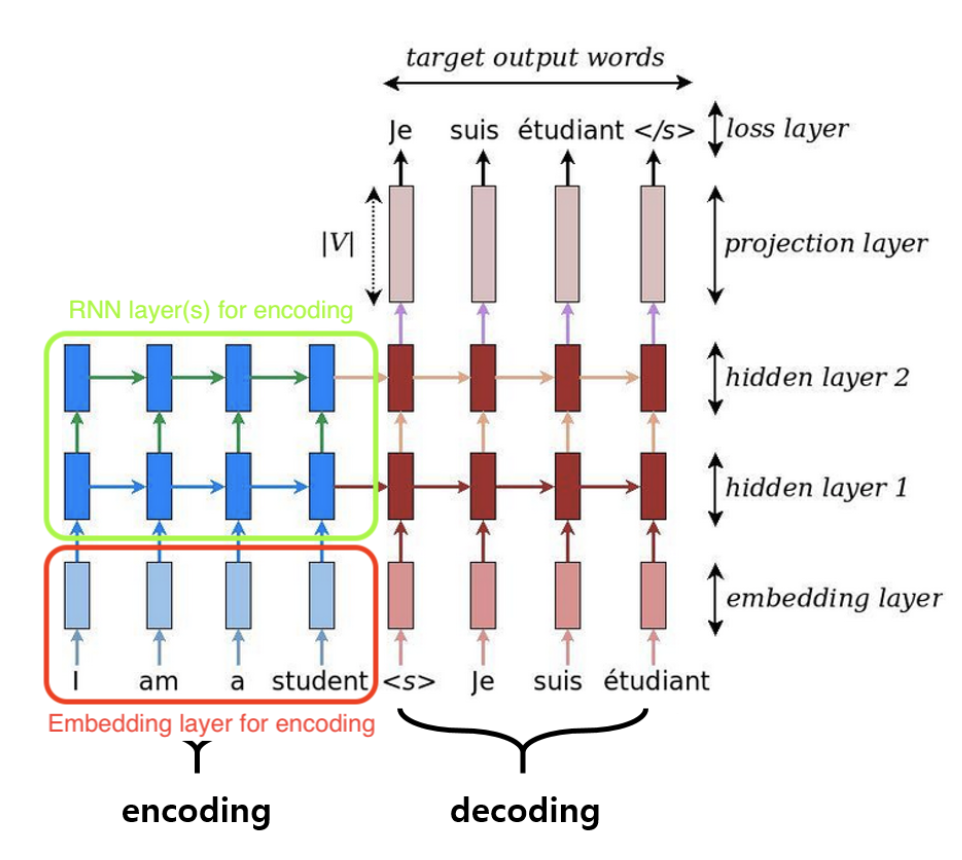
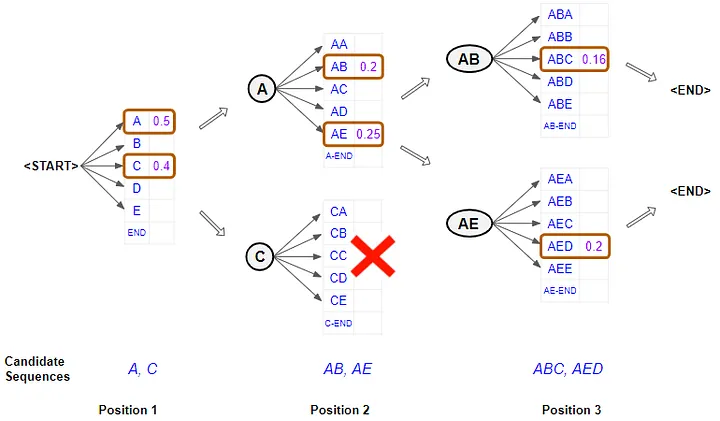
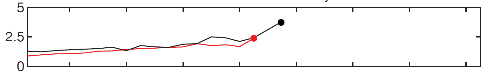
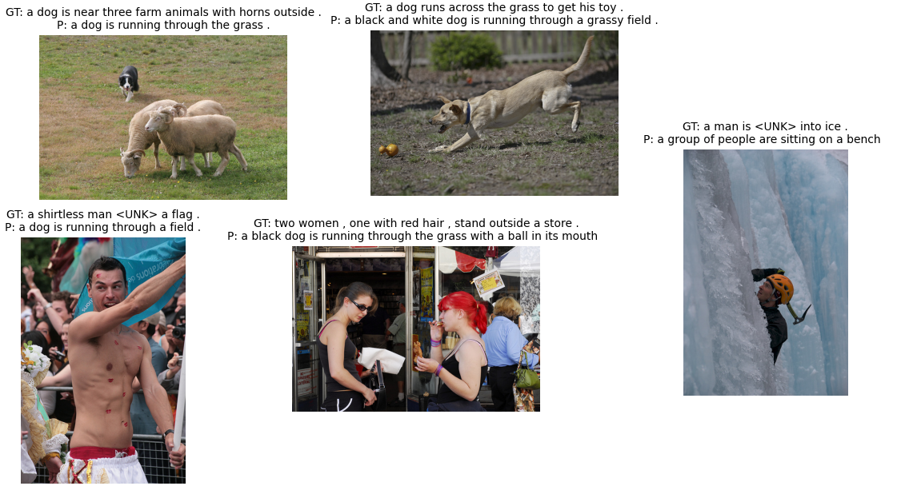

# 🖼️ NLP_Image_Captioning_using_CLIP_and_LSTM

## 📖 Mô tả dự án
Dự án **Image Captioning** sử dụng kiến trúc **Encoder-Decoder** kết hợp mô hình đa phương thức **CLIP** và mạng nơ-ron hồi quy **LSTM**. Hệ thống nhận đầu vào là một hình ảnh, tự động trích xuất đặc trưng ngữ nghĩa-thị giác và sinh ra chuỗi văn bản mô tả chính xác, tự nhiên nội dung ảnh. Dự án được phát triển dưới dạng đồ án môn học/Bài tập lớn, tập trung vào việc hiện thực hóa pipeline end-to-end từ tiền xử lý dữ liệu, huấn luyện mô hình, đến đánh giá định lượng & định tính.

---

## 🏗️ Kiến trúc & Công nghệ
Mô hình áp dụng kỹ thuật **Transfer Learning** với thành phần Encoder được đóng băng (frozen) để tận dụng khả năng biểu diễn đặc trưng đã học sẵn, giúp giảm thiểu tài nguyên tính toán và thời gian huấn luyện.

### 🔹 Tổng quan luồng xử lý
Quy trình chuyển đổi từ ảnh sang văn bản được minh họa qua sơ đồ kiến trúc đa phương thức và cơ chế học chuyển giao:


### 🔹 Thành phần cốt lõi
| Thành phần | Công nghệ | Vai trò & Cơ chế hoạt động |
|:---|:---|:---|
| **Encoder** | `CLIP` (ViT-B/32) | Trích xuất vector đặc trưng ảnh đa phương thức. Encoder được giữ cố định, chỉ đóng vai trò Feature Extractor. |
| **Decoder** | `LSTM` + `Attention` | Sinh chuỗi từ tuần tự dựa trên đặc trưng ảnh. Cơ chế Attention giúp mô hình tập trung động vào vùng ảnh quan trọng tại mỗi bước sinh từ. |
| **Cơ chế sinh** | `Beam Search` | Thay thế Greedy Search, duy trì `k` ứng viên tốt nhất để tối ưu hóa xác suất chuỗi toàn cục, giảm lỗi tích lũy. |





### 🛠️ Công nghệ & Thư viện phụ thuộc
- **Deep Learning:** `PyTorch` (torch, nn, optim, utils.data)
- **Vision/NLP:** `openai-clip`, `nltk`, `PIL`
- **Hỗ trợ:** `pandas`, `numpy`, `matplotlib`, `tqdm`, `os`, `random`

---

## ✨ Tính năng chính
- ✅ **Pipeline End-to-End:** Tích hợp trọn vẹn từ tiền xử lý dữ liệu, xây dựng từ vựng, caching đặc trưng CLIP, huấn luyện, đến inference.
- ✅ **Attention Mechanism:** Tích hợp Attention vào đầu ra LSTM, cải thiện khả năng căn chỉnh ngữ cảnh ảnh-văn bản theo từng bước thời gian.
- ✅ **Tối ưu hiệu năng:** Pre-compute & cache CLIP features trước khi train, kết hợp `Early Stopping` (patience=2) để tránh overfitting và tiết kiệm thời gian.
- ✅ **Đánh giá đa chiều:** Hỗ trợ tính toán định lượng (BLEU-1 đến BLEU-4 qua `nltk.corpus_bleu`) và trực quan hóa định tính (so sánh Ground Truth vs Prediction).
- ✅ **Checkpoint tự động:** Lưu mô hình tốt nhất dựa trên Validation Loss cùng trạng thái từ điển (`vocab.pkl`).

---

## 📦 Cấu trúc thư mục
```text
NLP_Image_Captioning_using_CLIP_and_LSTM/
├── clip_lstm_test.ipynb      # 🚀 Entry point: Code huấn luyện & demo (Jupyter Notebook)
├── docs/                     # 📚 Tài liệu & Báo cáo
│   ├── BaoCaoBTLFinal.pdf    # Báo cáo chi tiết cơ sở lý thuyết, thực nghiệm & kết luận
│   └── ảnh/                  # 🖼️ Asset minh họa: sơ đồ kiến trúc, biểu đồ loss, kết quả mẫu
└── README.md                 # 📘 Tài liệu hướng dẫn sử dụng (hiện tại)
```

---

## 🛠️ Hướng dẫn Cài đặt & Cấu hình
> ⚠️ **Lưu ý:** Kho lưu trữ hiện chưa bao gồm file `requirements.txt` và bộ dữ liệu `data/`. Vui lòng thực hiện các bước sau để tái lập môi trường.

### 1. Cài đặt thư viện
Khuyến nghị chạy trên **Google Colab** hoặc môi trường Python 3.9+ để tránh xung đột phiên bản CLIP/PyTorch.
```bash
pip install torch torchvision openai-clip pandas numpy matplotlib nltk tqdm pillow
```

### 2. Chuẩn bị dữ liệu
1. Tải bộ dataset **Flickr8k** (hoặc tương thích).
2. Cấu trúc thư mục `data/` như sau:
   ```text
   data/
   ├── images/        # Chứa 8,000 ảnh .jpg
   └── captions.txt   # File chú thích định dạng: image_name#caption_index \t caption_text
   ```
3. Cập nhật đường dẫn `DATA_DIR`, `IMAGE_DIR`, `CAPTIONS_FILE` trong các cell đầu tiên của `clip_lstm_test.ipynb`.

---

## 🚀 Hướng dẫn Sử dụng
Mở file `clip_lstm_test.ipynb` bằng Jupyter Notebook / Jupyter Lab hoặc Google Colab, sau đó chạy tuần tự từ trên xuống dưới:

| Bước | Nội dung thực thi |
|:---|:---|
| **1. Tiền xử lý** | Load caption, tokenize bằng NLTK, lọc từ vựng (tần suất ≥ 5), mã hóa số, padding & chèn `<SOS>`/`<EOS>`. |
| **2. Caching** | Chạy `cache_clip_features()` để trích xuất & lưu sẵn embedding ảnh qua CLIP, tăng tốc đáng kể vòng lặp huấn luyện. |
| **3. Huấn luyện** | Khởi tạo `CLIPCaptionModel` + `CrossEntropyLoss` + `Adam`. Train theo epoch với `batch_size=32`, `lr=3e-4`. Hệ thống tự động lưu checkpoint tốt nhất. |
| **4. Suy luận** | Load `best_model.pth`, sinh caption trên tập test sử dụng **Beam Search** (`beam_size=5`). |
| **5. Đánh giá** | Trực quan hóa kết quả & tính toán chỉ số BLEU để so sánh với nhãn thực tế. |

---

## 📊 Kết quả thực nghiệm
### 🔹 Quá trình huấn luyện
Mô hình được huấn luyện qua tối đa 15 epoch với cơ chế giám sát Validation Loss. Hệ thống kích hoạt **Early Stopping tại Epoch 11**, mô hình tốt nhất được ghi nhận tại **Epoch 9** với `Validation Loss = 3.1911`. Đường cong loss giảm đều, không xuất hiện hiện tượng overfitting nghiêm trọng.



### 🔹 Đánh giá định lượng & định tính
Chỉ số BLEU phản ánh độ khớp n-gram giữa caption sinh ra và nhãn tham chiếu:
| Chỉ số | Giá trị |
|:---|:---|
| BLEU-1 | `0.2706` |
| BLEU-2 | `0.0850` |
| BLEU-3 | `0.0382` |
| BLEU-4 | `0.0201` |

Kết quả định tính cho thấy mô hình có khả năng sinh câu đúng ngữ pháp cơ bản, nhưng vẫn tồn tại xu hướng sinh caption chung chung hoặc nhận diện sai đối tượng trong ảnh phức tạp.


---

## ⚠️ Hạn chế & Hướng phát triển
- **Hạn chế hiện tại:** 
  - BLEU-4 còn thấp (`~0.02`), phản ánh khả năng mô hình hóa chuỗi dài & cấu trúc câu phức tạp chưa tối ưu.
  - Caption có xu hướng lặp lại các mẫu phổ biến (bias dữ liệu Flickr8k), thiếu tính cụ thể với ảnh nhiều đối tượng.
  - Kiến trúc LSTM giới hạn khả năng xử lý phụ thuộc xa so với các mô hình hiện đại.
- **Hướng phát triển:**
  1. Nâng cấp Attention lên **Multi-Head Self-Attention** để nắm bắt quan hệ không gian chính xác hơn.
  2. Thay thế Decoder LSTM bằng **Transformer Decoder** hoặc tích hợp Pre-trained LLM (GPT/LLaMA) để cải thiện tính mạch lạc & đa dạng.
  3. Mở rộng dataset sang **MS-COCO** hoặc **Conceptual Captions** để tăng độ phủ ngữ nghĩa.

---

## 👥 Thành viên thực hiện & Tài liệu tham khảo
- **Đề tài:** Ứng dụng mô hình CLIP và LSTM trong bài toán tạo chú thích ảnh (Image Captioning)
- **Khoa/Bộ môn:** Khoa Công nghệ Thông tin – Bộ môn Khoa học Máy tính, Trường Đại học Xây dựng Hà Nội
- **Giảng viên hướng dẫn:** ThS. Nguyễn Đình Quý
- **Nhóm thực hiện (Lớp 67CS1):**
  - Nguyễn Hải Cường (0174067)
  - Lã Minh Khánh (4004267)
  - Trịnh Quỳnh Anh (0279367)
  - Phạm Hồng Thái (0127067)

📄 **Báo cáo chi tiết:** Xem toàn bộ cơ sở lý thuyết, phương pháp luận, bảng kết quả & phân tích lỗi tại:  
👉 [`docs/BaoCaoBTLFinal.pdf`](docs/BaoCaoBTLFinal.pdf)

---
*© 2024 NLP_Image_Captioning_using_CLIP_and_LSTM. Tài liệu được viết phục vụ mục đích học thuật & nghiên cứu.*
